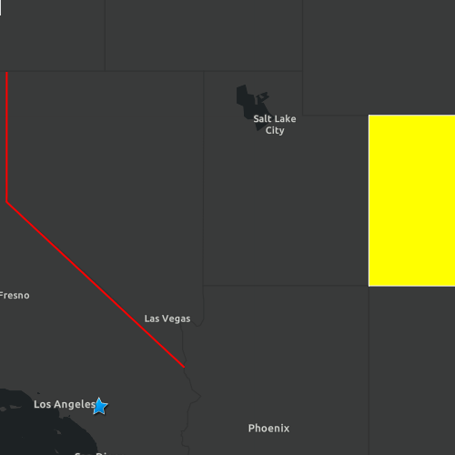

# Create and save KML file

Construct a KML document and save it as a KMZ file.

## Use case

If you need to create and save data on the fly, you can use KML to create points, lines, and polygons and then serializing them as KML nodes in a KML Document. Once complete, you can share the KML data with others that are using a KML reading application, such as ArcGIS Earth.

## How to use the sample

Application opens to a view of the Southwestern United States. Click on the "Save KMZ file" button to save the active KML document as a .kmz file on your system.

## How it works

1. Create a `Point`, `Polyline`, and `Polygon`.
2. Create a `Graphic` for each and add it to the `GraphicsOverlay`
3. Create a `KmlGeometry` object using the `Geometry` from the point, line, and polygon.
4. Create a `KmlPlacemark` for each kml geometry.
5. Add all three kml placemarks to the `KmlDocument`.
6. Save the kml document to a file using the `saveAs` function.

## Relevant API

* KmlDocument
* KmlGeometry
* KmlNode::saveAs
* KmlPlacemark

## Tags

Keyhole, KML, KMZ, OGC
